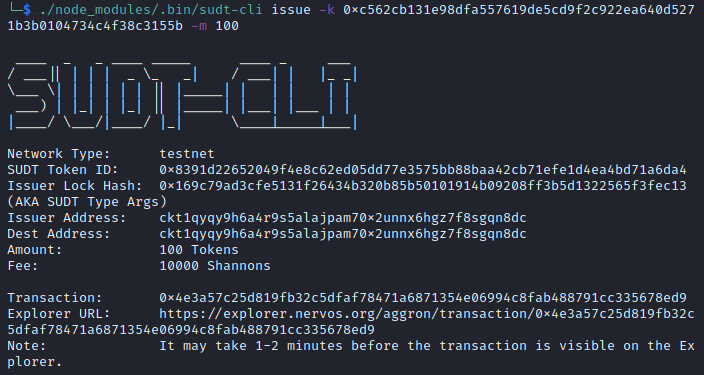
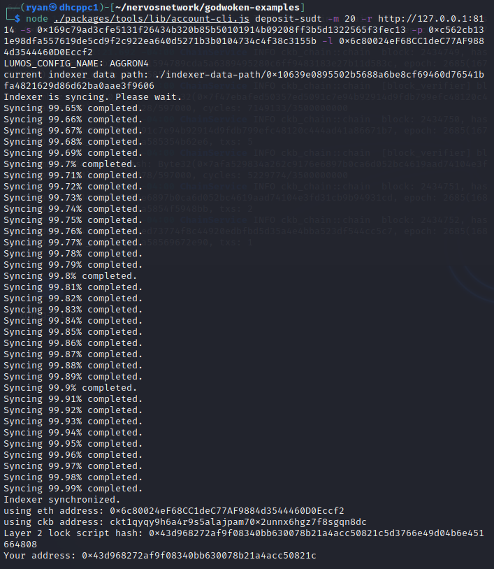
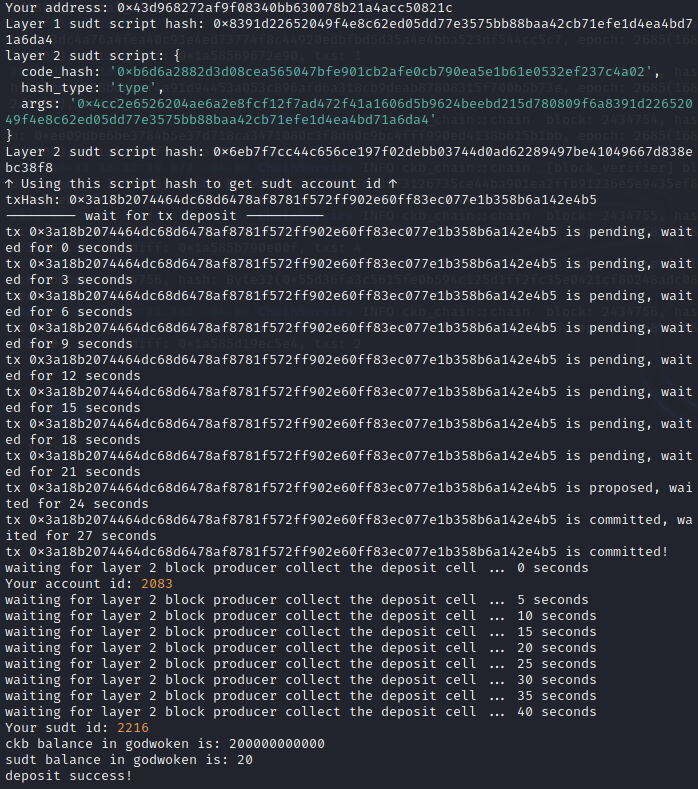

1) Link To Layer 1 address funded
```
https://explorer.nervos.org/aggron/address/ckt1qyqy9h6a4r9s5alajpam70x2unnx6hgz7f8sgqn8dc
```
2)A screenshot of the console output immediately after using sudt-cli to create your SUDT tokens on Layer 1.

3)A link to the transaction ID created by sudt-cli on the Testnet Explorer.
```
https://explorer.nervos.org/aggron/transaction/0x4e3a57c25d819fb32c5dfaf78471a6871354e06994c8fab488791cc335678ed9
```
4)A screenshot of the console output immediately after you have successfully submitted a deposit to Layer 2 using the account-cli tool


5)The SUDT ID from the console output after executing the deposit script (in text format).
```
2216
```